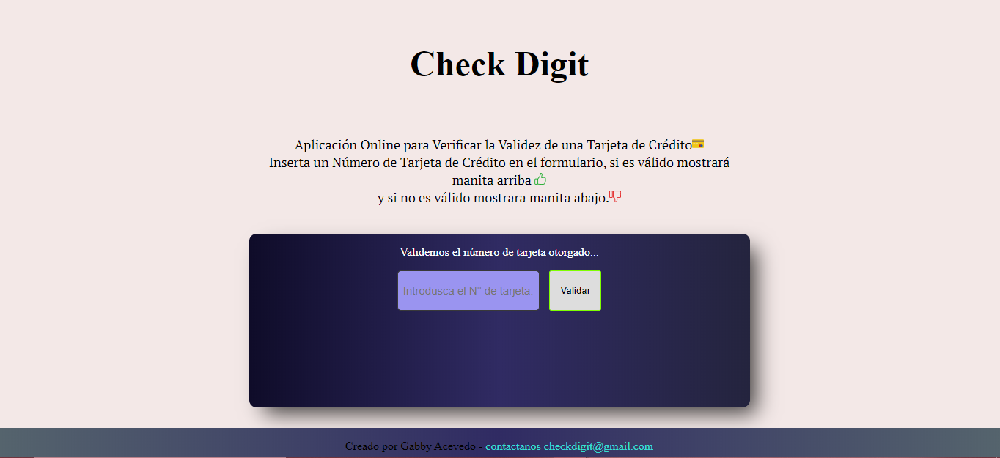
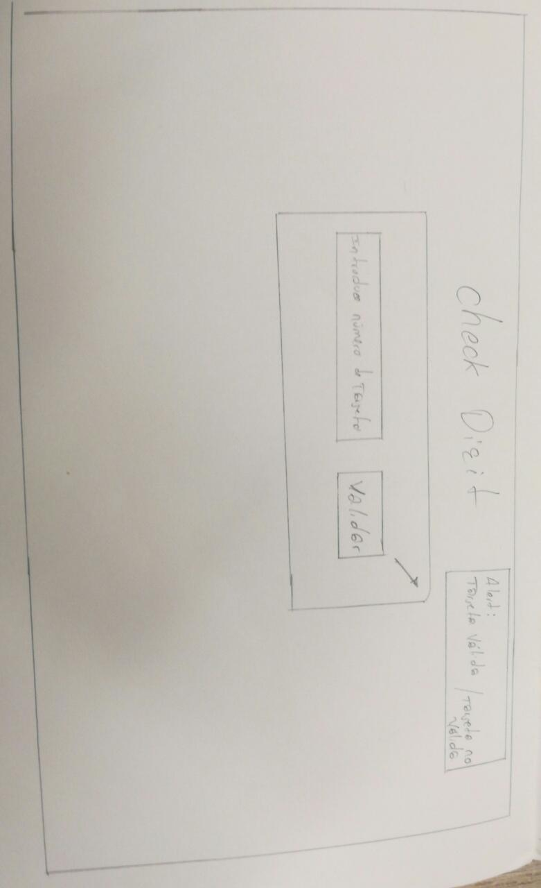
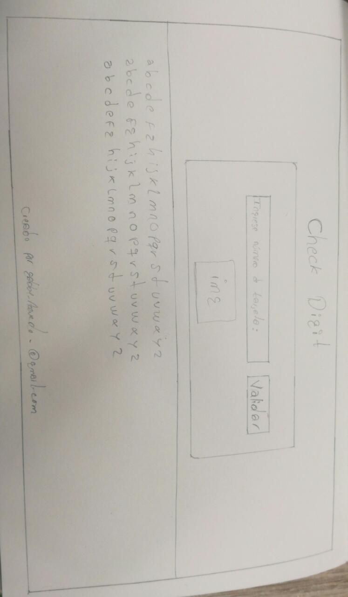
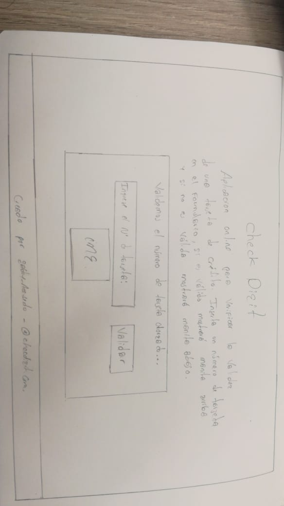

# Proyecto Validación de Tarjetas de crédito
## Índice

* Titulo de Proyecto:
* Resumen:
* Objetivos:
* Investigación UX:

    1. Descubrimiento e Investigacion (Research):
    2. Síntesis y definición:
    3. Ideación:
    4. Prototipado:
     
       * Prototipo de baja fidelidad:
       * Prototipo de mediana fidelidad:
       * Prototipo de alta fidelidad:

    5. User Testing:

## Título del Proyecto
  **Check Digit**

***

## Resumen

Check Digit es una aplicación web dirigida a usuarios que hayan adquerido una tarjeta virtual, via online y desean validar el número de la misma para evitar cualquier incomveniente.

## Objetivos

El objetivo de la aplicación web es permitir a los usuarios validar el número de su tarjeta, de tal forma que les permita saber si el numero de tarjeta otorgado es válido o inválido. Además de darles la posibilidad de interactuar con mayor comodidad con el facilitador de la aplicación.

## Investigación UX
   1. Descubrimiento e investigación (Research)

Los usuarios son personas de género indistinto, con edades de entre 18 y 55 años y con conocimiento intermedio del uso de tecnologías y aplicaciones móviles. Quienes suelen realizar compras online con mayor frecuencia.

  2. Síntesis y definición

En la etapa de Investigación Contextual se reconció de forma clara el perfil común de un usuario, además de sus necesidades para idear el desarrollo de la aplicación web.

  3. Ideación

Se idearon y maquetaron varias posibles propuestas para cada funcionalidad a implementar. A continuación se mostrará el boceto de la pantalla del cuál se  recibió feedback que nos indica mejorar / cambiar la interfaz.
  
  * Boceto de ideación para la funcionalidad: 

  
     
En esta pantalla se consideró la funcionalidad básica de ingresar el número a validar y mostrar el resultado en una ventana de alert.

  * Feedback:

El usuario indica que la aplicacion no es de fácil comprensión y no es muy amigable, sugiere poner una pequeña descripción de la funcionalidad y el resultado final poder mostrar con una imagen de ser podible.

 * Despues del feedback

Se reconoció que la interfáz ideada no era muy amigable y entendible para el usuario.

 4. Prototipado

En éste punto se procede a unir insights adquiridas en el proceso de Ideación y los feedbacks para lograr obtener una interfaz adecuada y y amigable para el tipo de usuario.

  * Feddback:

En este feedback el susario indica adicionar un texto descriptivo dentro del formulario, además sugiere que el párrafo de la parte inferior como se ve en el prototipo se veria mejor si va en la parte superior.

* Despues del feedback:

* Prototio de alta fidelidad:

5. User Testing

